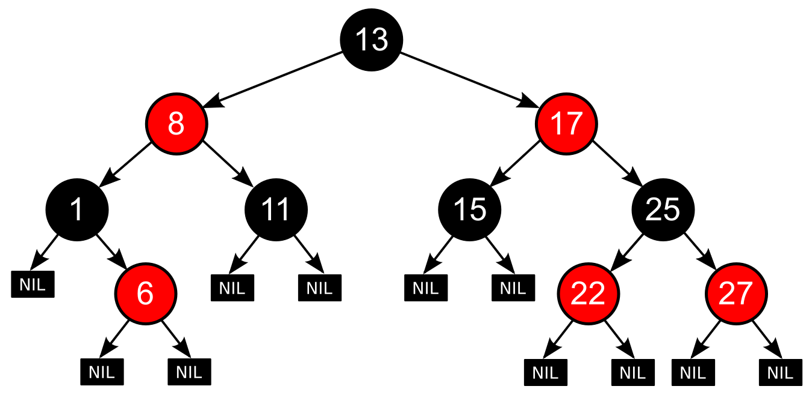

## Overview

This project delivers an interactive Red‑Black Tree visualization using **Streamlit**, **NetworkX**, and **Matplotlib**. A Red‑Black Tree is a self‑balancing binary search tree that guarantees \(O(\log n)\) time complexity for searches, insertions, and deletions by enforcing simple color and rotation rules. The visualization highlights each insertion, rotation, and recoloring step in real time, clarifying how the tree restores its red‑black properties and maintains balance.

